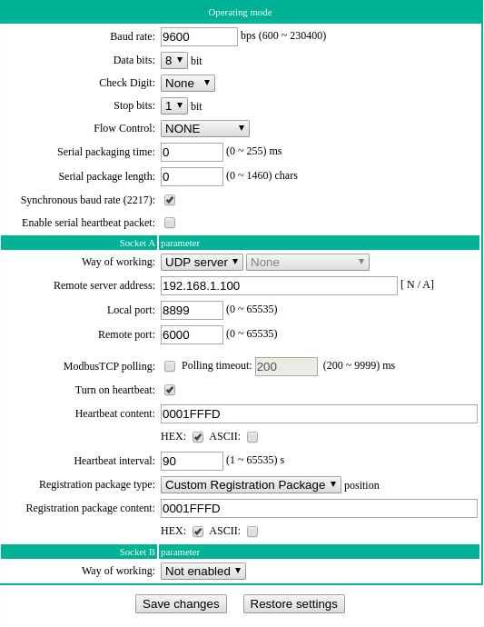

#### HZWOYO Relay script ####

Python script for controlling this network enabled 8-channel input/output board with 30A relays.

http://hzwoyo.com/product-detail/eth8io30a/

https://www.aliexpress.com/item/32995510296.html

### Example ### 

Puls relay #7 on for ~5 of seconds.

```./hzwoyorelay.py -i 192.168.1.110 -r 7```

### Oppsett ###

Select "UDP Server" (UDP 服务器)  under "Control Relay Configuration" (控制继电器配置)

